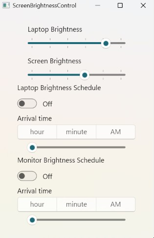

# ScreenBrightnessControl

Tool to control laptop and connected monitor brightness. It was built on modern Win UI. I use it to control brightness of my **LG 27MD5KL-B**, since it doesn't have any physical button to control brightness. 

